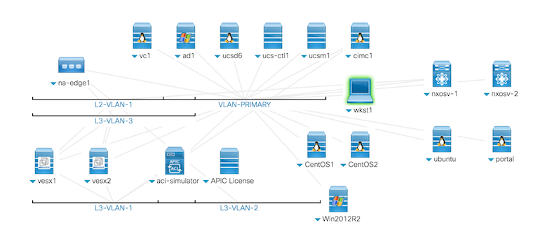
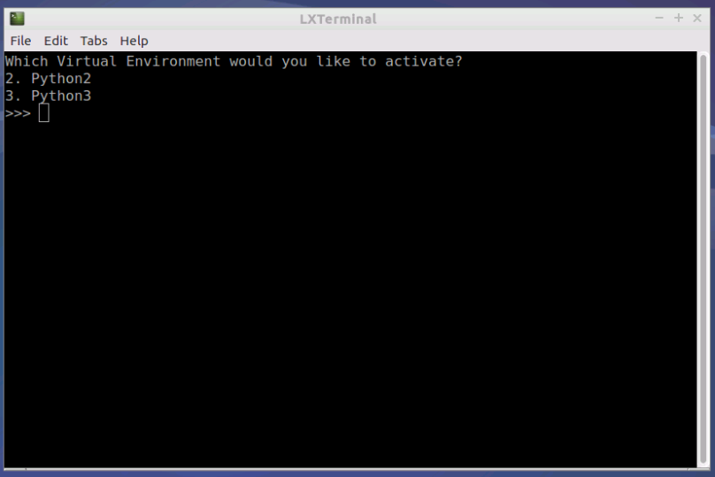

# Basic pod info



| Hostname | Description | IP Address | Credentials |
| --- | --- | --- | --- |
| **wkst1** | Dev Workstation: Windows | 198.18.133.36 | dcloud\demouser/C1sco12345 |
| **ubuntu** | Dev Workstation: Linux | 198.18.134.28 | root/C1sco12345 |
| **nxosv-1** | Nexus 9000v - 7.0.3(I2).1 | 198.18.134.140 | admin/C1sco12345 |
| **nxosv-2** | Nexus 9000v - 7.0.3(I2).1 | 198.18.134.141 | admin/C1sco12345 |
| **centos1** | CentOS 7 Server - Automation Target | 198.18.134.49 | root/C1sco12345 or demouser/C1sco12345 |
| **centos2** | CentOS 7 Server - Automation Target | 198.18.134.50 | root/C1sco12345 or demouser/C1sco12345 |
| ucsctl1 | UCS Central - 1.5(1b) | 198.18.133.90 | admin/C1sco12345 |
| ucsm1 | UCS Manager Emulator | 198.18.133.91 | admin/C1sco12345 |
| apic1 | ACI Simulator - 2.1.1h | 198.18.133.200 | admin/C1sco12345 |
| ucsd | UCS Director - 6.0.1.1 | 198.18.133.112 | admin/C1sco12345 |
| win2012r2 | Windows 2012 Standard Server - Automation Target | 198.18.133.20 | dcloud\administrator/C1sco12345 |
| vc1 | vCenter 6.0 | 198.18.133.30 | administrator@vsphere.local/C1sco12345! |
| vesx1 | vSphere Host | 198.18.133.31 | root/C1sco12345 |
| vesx2 | vSphere Host | 198.18.133.32 | root/C1sco12345 |
| cimc1 | UCS IMC Emulator | 198.18.134.88 | root/C1sco12345 or admin/C1sco12345 |
| na-edge1 | vNetApp | 198.18.133.115 | root/C1sco12345 |
| ad1 | Domain Controller | 198.18.133.1 | administrator/C1sco12345 |


## Getting connected

We will loosely follow Steps 2 and 3 at: https://learninglabs.cisco.com/tracks/devnet-express-dci/devnet-express-dci-prep/dne-dci-prep-01/step/2

1. Run Anyconnect client and fill in url with ```dcloud-lon-anyconnect.cisco.com``` 

1. Click connect, and log in with the credentials from your assigned pod, listed below:

| Session Id |  Session Name |  Usernames |  Password |  Start |  Stop |  DNS Assets |  Shared With |  Endpoint Kits |  Public IPs |
| --- | --- | --- | --- | --- | --- | --- | --- | --- | --- |
| a | a | a | a | a | a | a | a | a | a | 


1. If you do not have a VNC client, RDP to 198.18.133.36 with your preferred client. Log in with user: ```dcloud\demouser``` and password ```C1sco12345```

    1. From Jumphost Download VNC from https://www.realvnc.com/download/file/viewer.files/VNC-Viewer-6.17.1113-Windows.exe
    1. Install VNC viewer on Jumphost

1. Within VNC client, connect to 198.18.134.28:1

1. From Ubuntu Desktop, run "Terminal for coding"


1. Choose "2" for Python 2

1. Run ```pip install ansible --upgrade```

1. Run ``ansible --version`` and confirm you are at verion 2.5.x

1. Run ```cd ~``` to return to your home directory

1. Run ```git clone https://github.com/securenetwrk/ansible-workshop.git``` to pull down the repo for the labs


https://learninglabs.cisco.com/tracks/devnet-express-dci 

https://github.com/securenetwrk/ansible-workshop

